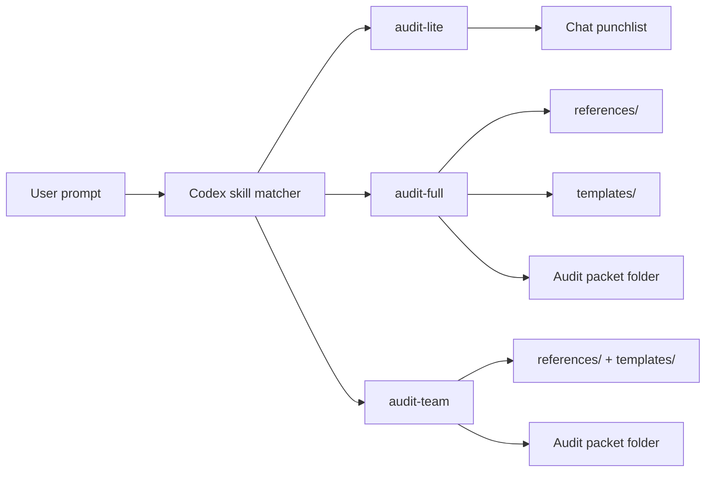
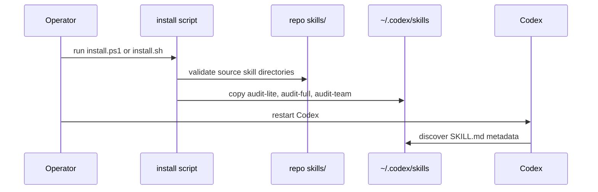

# Architecture

## Overview

Codex Audit Skills is a small skill distribution repository. It has no runtime server and no package manager dependency. Installation copies skill directories into Codex's skill home.

## Skill Relationship



## Install Flow



## Directory Contract

```text
skills/
  audit-lite/
    SKILL.md
    agents/openai.yaml
  audit-full/
    SKILL.md
    agents/openai.yaml
    references/
    templates/
  audit-team/
    SKILL.md
    agents/openai.yaml
    references/
    templates/
```

## Design Decisions

### Full-Fidelity Ports

The Claude source used `audit-lite`, `audit-team`, and a bundled `audit-team-full` directory. This repository keeps the full behavior of each source:

- `audit-lite` remains the compact reviewer.
- `audit-team` remains the original five-role audit workflow.
- `audit-full` is the Codex-native name for the bundled full audit.

Original source files are stored under `source-originals/claude/` so maintainers can diff future adaptations against the source material.

### References Stay Bundled

The full audit skill can be context-heavy. Role guidance, severity rules, and templates live in bundled files so Codex loads them only when needed.

### No Server

The repo is static by design. Install scripts copy files; validation checks structure.

## Trust Boundary

The skills instruct Codex how to audit. They do not make findings true by themselves. Evidence still has to come from files, commands, browser checks, release assets, CI, or live runtime observations.
